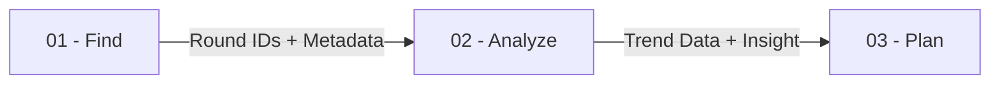

# 00 - Product Orchestration

## Project Vision & Mission
**Retake** is an AI-powered platform for Valorant coaches that transforms manual VOD review into tactical intelligence. It provides a linear workflow to discover data, synthesize patterns, and plan counters.

### Core KPIs (Success Metrics)
- **Discovery Accuracy**: >95% relevance in retrieved clips.
- **Latency**: < 3s for semantic query responses.
- **Precision**: ±2s accuracy in VOD timestamp mapping.

## The Value Chain (The Harness)
Each module is a standalone service that passes data down the chain via the **Session Context**.

### 1. [FIND (Discovery & Retrieval)](01-find/overview.md)
- **Role**: On-demand scraping and vector search.
- **Primary Harness**: Produces `VodResult[]` with precise YouTube start times.

### 2. [ANALYZE (Insight Synthesis)](02-analyze/overview.md)
- **Role**: Statistical processing and cross-referencing (RIB/VLR).
- **Primary Harness**: Produces `TacticalSummary` and `TrendVisualizationData`.

### 3. [PLAN (Generative Strategy)](03-plan/overview.md)
- **Role**: Scenario simulation and playbook generation.
- **Primary Harness**: Produces `StrategyCard` with predicted success rates.

## Global Technology Stack
- **Frontend**: Bun + TanStack Start (React 19) + Tailwind v4.
- **Backend**: Python 3.10+ (FastAPI) + ChromaDB.
- **AI Layers**: Google Gemini 3 (Pro/Flash) + ElevenLabs (Voice).

## Developer Resources
- [Development Standards](shared/development-standards.md)
- [API Specification](shared/api-specification.md)