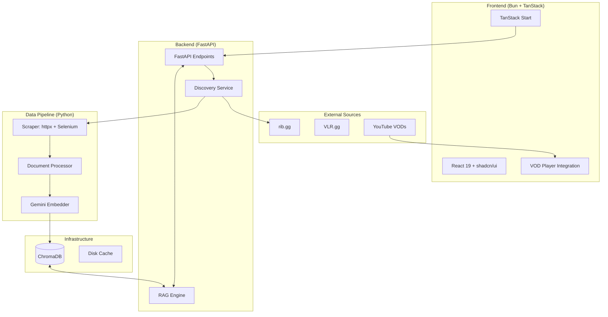

# Global Architecture & Tech Stack

## System Architecture (v2)
Retake uses a decoupled polyglot architecture. The discovery and retrieval logic is handled by a Python service, while the user interface and orchestration are managed by a Bun/React application.

## Technology Stack

### Frontend
- **Runtime**: Bun
- **Framework**: TanStack Start (React 19)
- **Styling**: Tailwind CSS v4 + shadcn/ui (Rounded-None aesthetic)
- **State**: TanStack Query

### Backend & AI
- **API**: FastAPI (Python 3.10+)
- **Vector DB**: ChromaDB (Defaulting to 3072-dim vectors)
- **Models**:
  - **LLM**: Gemini 3 Pro (Reasoning) / Gemini 3 Flash (Streaming)
  - **Embeddings**: gemini-embedding-001
  - **Voice**: ElevenLabs (Eleven Turbo v2.5)

### Data Acquisition
- **Clients**: httpx (Async), Selenium (Anti-bot bypass)
- **Parsing**: BeautifulSoup4, __NEXT_DATA__ extraction
